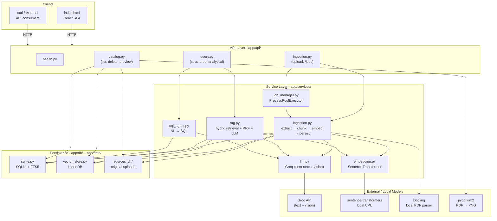
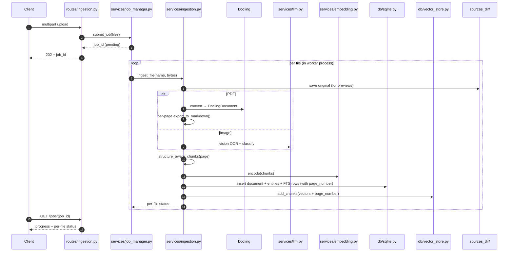
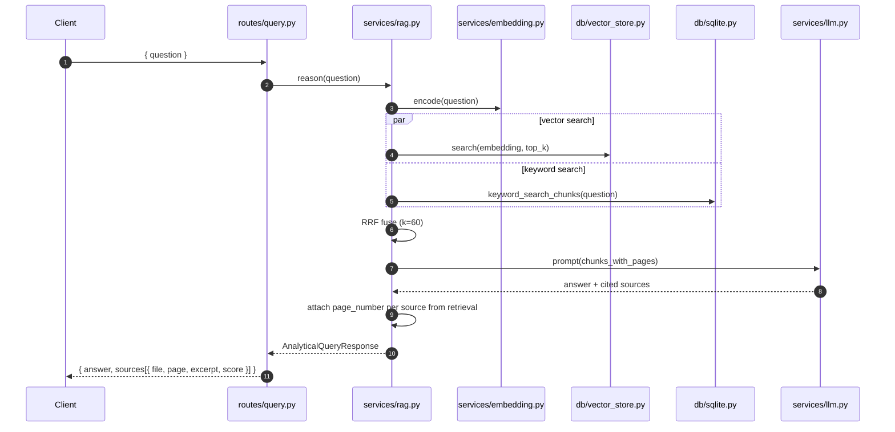
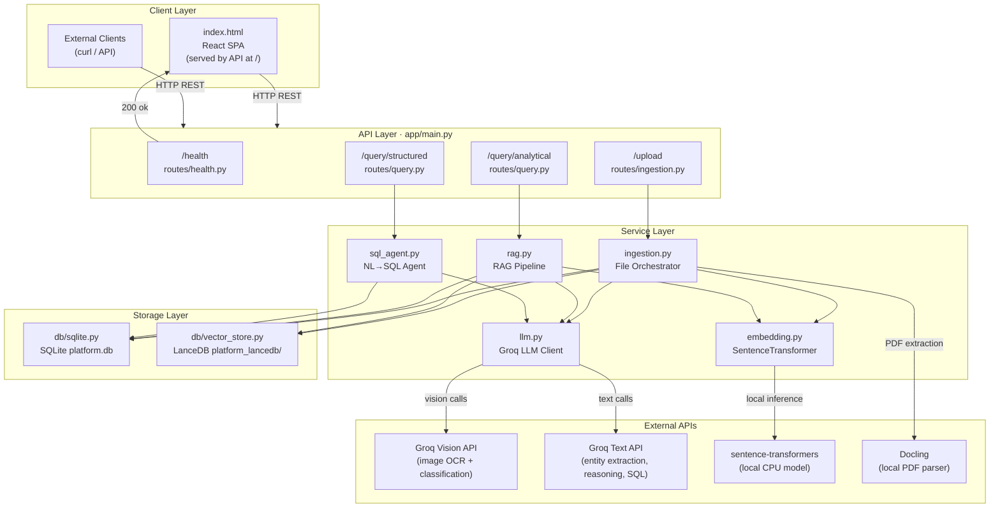
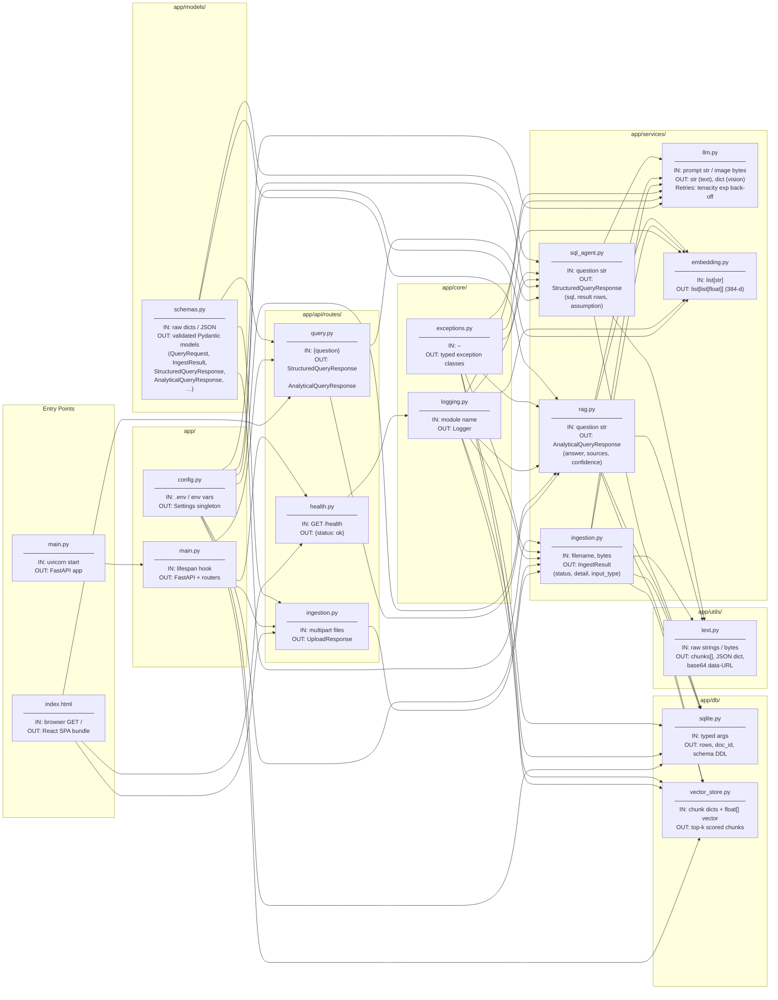
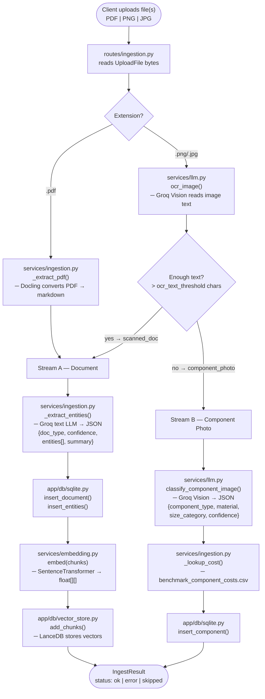
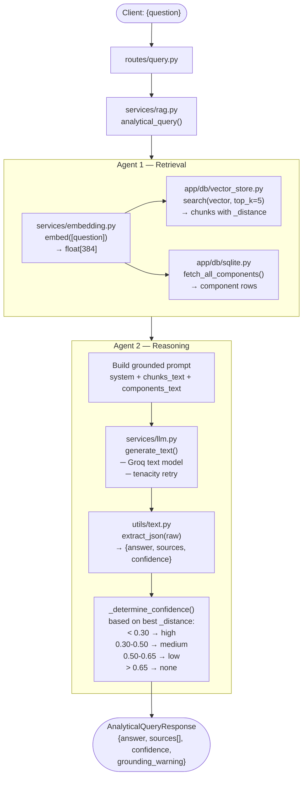
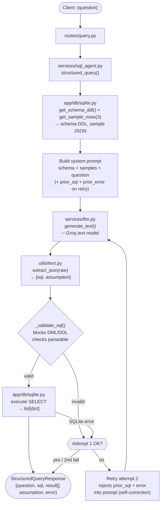
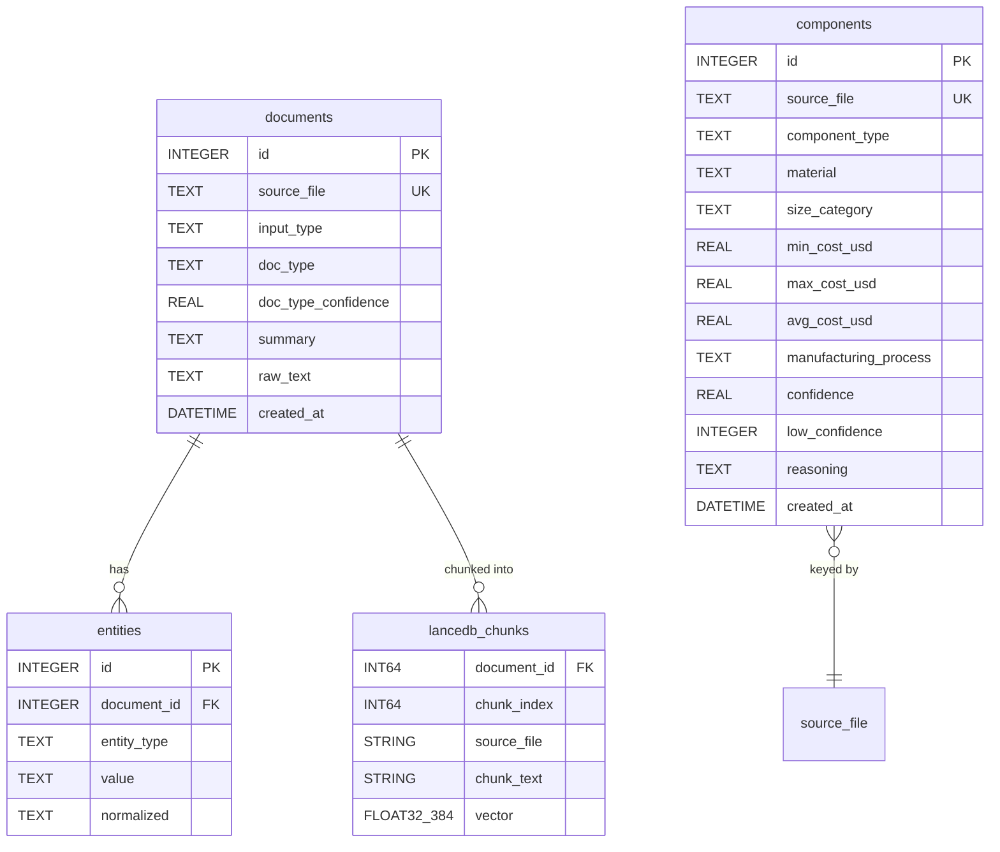

# Architecture

Enterprise Document Intelligence Platform — a self-contained FastAPI service
that ingests mixed documents and component photos, then answers two flavours
of questions:

| Endpoint              | Purpose                                                           |
| --------------------- | ----------------------------------------------------------------- |
| `POST /query/structured`  | Natural-language → SQL over the relational catalog.           |
| `POST /query/analytical`  | Hybrid (vector + keyword) RAG with cited sources.             |

The bundled React SPA (`app/web/index.html`) is served at `GET /` so the API
ships as a single image with no separate frontend container.

---

## 1. Layered View



---

## 2. Folder Layout

```
kearney_assignment/
├── Dockerfile
├── docker-compose.yml
├── requirements.txt
├── README.md
├── architecture.md
├── .env.example
├── .gitignore
│
├── app/                         ← installable Python package
│   ├── __init__.py
│   ├── main.py                  ← FastAPI factory + lifespan + UI route
│   ├── config.py                ← Pydantic Settings (env-driven)
│   │
│   ├── api/
│   │   ├── __init__.py
│   │   └── routes/
│   │       ├── health.py        ← GET /health
│   │       ├── ingestion.py     ← POST /upload, /upload/async, GET /jobs/{id}
│   │       ├── query.py         ← POST /query/structured, /query/analytical
│   │       └── catalog.py       ← GET/DELETE /catalog, GET /catalog/source
│   │
│   ├── services/
│   │   ├── ingestion.py         ← orchestrates extract → chunk → embed → persist
│   │   ├── job_manager.py       ← async ProcessPoolExecutor for /upload/async
│   │   ├── rag.py               ← hybrid retrieval + RRF + LLM reasoning
│   │   ├── sql_agent.py         ← NL → SQL with read-only guardrails
│   │   ├── llm.py               ← Groq text + vision client (tenacity retry)
│   │   └── embedding.py         ← SentenceTransformer wrapper
│   │
│   ├── db/
│   │   ├── sqlite.py            ← connections, migrations, CRUD, FTS5
│   │   ├── vector_store.py      ← LanceDB schema + add/search/delete
│   │   └── schema.sql           ← canonical DDL (loaded by init_db)
│   │
│   ├── models/
│   │   └── schemas.py           ← Pydantic request/response models
│   │
│   ├── core/
│   │   ├── exceptions.py        ← typed exception hierarchy
│   │   └── logging.py           ← structured logger config
│   │
│   ├── utils/
│   │   ├── image_preprocess.py  ← OpenCV pre-OCR pipeline
│   │   └── text.py              ← chunking helpers
│   │
│   ├── web/
│   │   └── index.html           ← React SPA (served by FastAPI at /)
│   │
│   └── data/
│       └── benchmark_component_costs.csv
│
└── tests/
    ├── conftest.py              ← isolates DB / LanceDB to a temp dir
    └── test_smoke.py            ← package + factory smoke tests
```

Each layer depends only on layers below it:

```
api  →  services  →  {db, llm, embedding}  →  config / core
```

---

## 3. Ingestion Flow (`POST /upload` and `/upload/async`)



---

## 4. Analytical Query Flow (`POST /query/analytical`)



The UI then calls `GET /catalog/source?file=…&page=…` per source to render an
inline preview (PDF page → PNG via pypdfium2, or the original image bytes).

---

## 5. Persistence Schema (high-level)

| Store    | Holds                                                                | Where                       |
| -------- | -------------------------------------------------------------------- | --------------------------- |
| SQLite   | `documents`, `entities`, `components`, `relationships`, `chunks_fts` | `settings.db_path` (WAL)    |
| LanceDB  | `chunks` table (vector + source_file + page_number + chunk metadata) | `settings.lancedb_path/`    |
| Filesystem | Original upload bytes (for preview rendering)                      | `settings.sources_dir/`     |

`chunks_fts` is a SQLite FTS5 virtual table tokenised with `porter unicode61`.
LanceDB uses cosine distance over a 384-dim space (`all-MiniLM-L6-v2`).

---

## 6. Concurrency Model

* **API process** — single uvicorn worker; FastAPI handles requests cooperatively.
* **Ingestion** — `ProcessPoolExecutor` (size = `INGEST_WORKERS`, default
  `min(4, cpu_count())`). Each file is processed in a child process so heavy
  CPU work (Docling, sentence-transformers, OpenCV) doesn't block the API.
* **SQLite** — WAL journal mode + 30 s `busy_timeout` lets workers commit
  concurrently without "database is locked".

---

## 7. Configuration

All knobs live in [`app/config.py`](app/config.py) and are env-driven via
Pydantic Settings. See [`.env.example`](.env.example) for every variable.
# Architecture — Enterprise Document Intelligence Platform

## 1. High-Level System Overview



---

## 2. File Map & Responsibilities



---

## 3. Ingestion Pipeline (POST /upload)



---

## 4. Analytical RAG Query (POST /query/analytical)



---

## 5. Structured SQL Query (POST /query/structured)



---

## 6. Storage Schema



---

## 7. Project File Tree

```
kearney_assignment/
├── requirements.txt                 ← Python dependencies
├── Dockerfile                       ← Single-image build: api + bundled UI
├── docker-compose.yml               ← api service
├── .env.example                     ← environment variable template
│
├── app/
│   ├── main.py                      ← FastAPI factory + async lifespan (uvicorn entry: app.main:app)
│   ├── config.py                    ← Pydantic Settings (env-driven)
│   │
│   ├── core/
│   │   ├── logging.py               ← Structured logging setup
│   │   └── exceptions.py            ← Exception hierarchy
│   │       (AppError → IngestionError, LLMError,
│   │        EmbeddingError, DatabaseError,
│   │        VectorStoreError, SQLValidationError)
│   │
│   ├── models/
│   │   └── schemas.py               ← Pydantic DTOs
│   │       (QueryRequest, IngestResult, UploadResponse,
│   │        ExtractionResult, ComponentClassification,
│   │        AnalyticalQueryResponse, StructuredQueryResponse,
│   │        SourceReference, ChunkRecord, EntityRecord)
│   │
│   ├── api/
│   │   └── routes/
│   │       ├── health.py            ← GET  /health
│   │       ├── ingestion.py         ← POST /upload
│   │       └── query.py             ← POST /query/structured
│   │                                   POST /query/analytical
│   │
│   ├── db/
│   │   ├── sqlite.py                ← All SQLite ops (context-manager conn)
│   │   └── vector_store.py          ← LanceDB add / search / reset
│   │
│   ├── services/
│   │   ├── llm.py                   ← Groq client (text + vision)
│   │   │                               tenacity retry, LLMError wrapping
│   │   ├── embedding.py             ← SentenceTransformer (lru_cache singleton)
│   │   ├── ingestion.py             ← File orchestrator (Stream A + B)
│   │   ├── rag.py                   ← Retrieve → Reason pipeline
│   │   └── sql_agent.py             ← NL→SQL with self-correction retry
│   │
│   └── utils/
│       └── text.py                  ← chunk_text, extract_json, image_to_data_url
│
└── platform_lancedb/                ← LanceDB data directory (runtime)
    └── chunks.lance/
```

---

## 8. Cross-Cutting Concerns

| Concern | Implementation |
|---|---|
| **Configuration** | `app/config.py` — Pydantic `BaseSettings`, all values overridable via env or `.env` |
| **Logging** | `app/core/logging.py` — structured `%(asctime)s \| %(levelname)s \| %(name)s \| %(message)s` on stdout |
| **Error handling** | Typed exception hierarchy in `app/core/exceptions.py`; services raise typed errors, routes return HTTP errors |
| **Retries** | `tenacity` exponential back-off on all Groq API calls (`LLM_MAX_RETRIES`, `LLM_RETRY_MIN/MAX_WAIT`) |
| **Validation** | Pydantic models at every API boundary; SQL safety via `_validate_sql()` (regex + sqlparse) |
| **Singletons** | `lru_cache(maxsize=1)` for Groq client, embedding model, Docling converter, LanceDB connection |
| **Secrets** | Never hardcoded — read from env / `.env` file via Pydantic Settings |
| **SQL injection** | Only `SELECT` allowed; DML/DDL blocked by regex; parameterised queries throughout |
